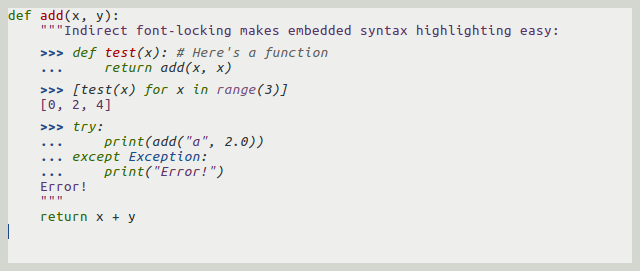

====================
 Indirect font-lock
====================

This is a small utility libraries for highlighting code embedded in comments or
strings.  Examples could include doctests in Python, examples in JavaDoc, code
snippets in LaTeX or reStructuredText, etc.  This library doesn't implement any
of that, though: it just provides the plumbing to do so.

Here's how it could look in practice:

And here's how you'd achieve that::

   (font-lock-add-keywords nil
     '(("^#*\\s-*\\(>>>\\|\\.\\.\\.\\) ?\\( *\\(.+\\)$\\)"
        (0 (indirect-font-lock-highlighter 3 'python-mode)))))
